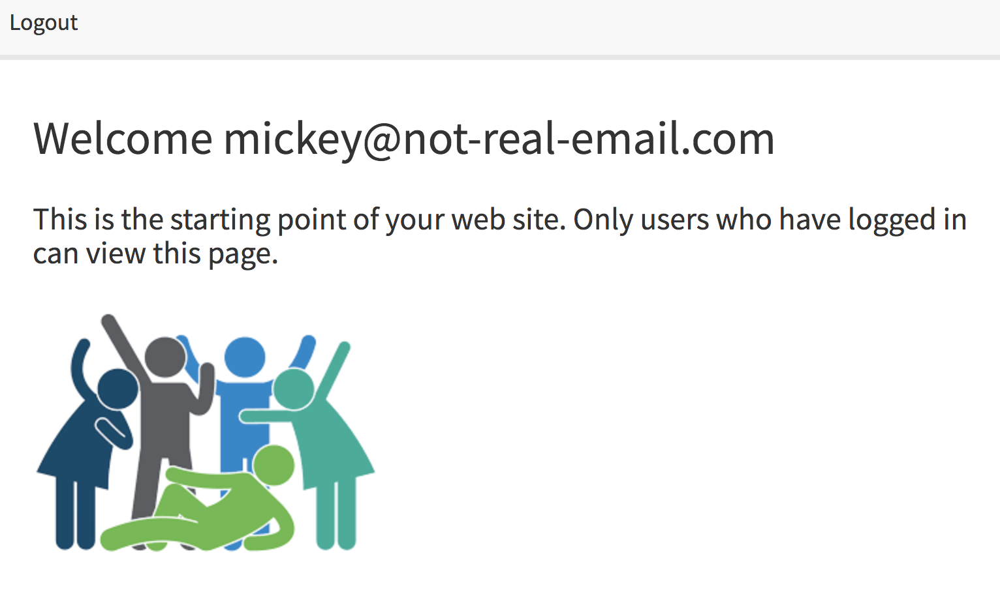

# User Authenication Boiler Plate

### Overview

This boiler plate is the skelton of user athenication for an application using MySql, Express, Sequelize, and Passport.  Passwords are encrypted and stored in your sql data base. 

### Setup

To begin, click clone or download repo to save the boiler plate your desired directory.  Then open the folder in your favorite editor.  
    **Before getting started**
    
    1. Create a database named `passport_demo`

    2. Customize the config/config.json file to fit your system requirements

    [
        {
        "development": {
            "username": "CHANGE THIS FOR WHAT YOU NEED",
            "password": "CHANGE THIS FOR WHAT YOU NEED",
            "port": "SET THIS TO MATCH YOUR PORT",
            "database": "passport_demo",
            "host": "127.0.0.1",
            "dialect": "mysql"
        },
        "test": {
            "username": "CHANGE THIS FOR WHAT YOU NEED",
            "password": "CHANGE THIS FOR WHAT YOU NEED",
            "database": "database_test",
            "host": "127.0.0.1",
            "dialect": "mysql"
        },
        "production": {
            "username": "CHANGE THIS FOR WHAT YOU NEED",
            "password": "CHANGE THIS FOR WHAT YOU NEED",
            "database": "database_production",
            "host": "127.0.0.1",
            "dialect": "mysql"
        }
        }
    ]

Now let's get it up and running,

First install all of the required node packages:
`npm i`

Next node the server file:
`node server.js`

You are all set!

### Screen Shots

#### Members ONLY view
